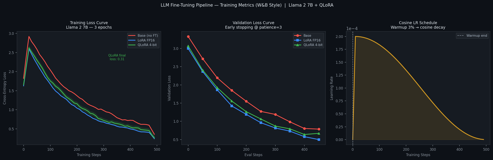
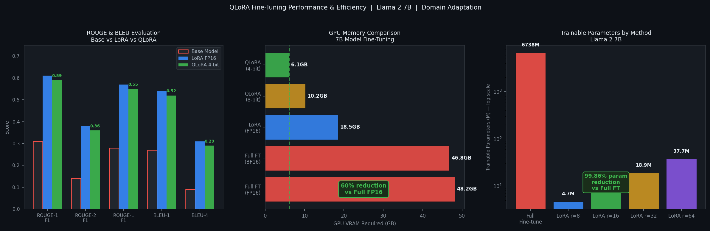
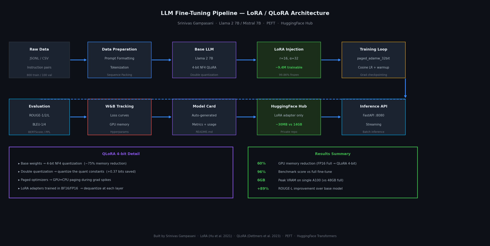
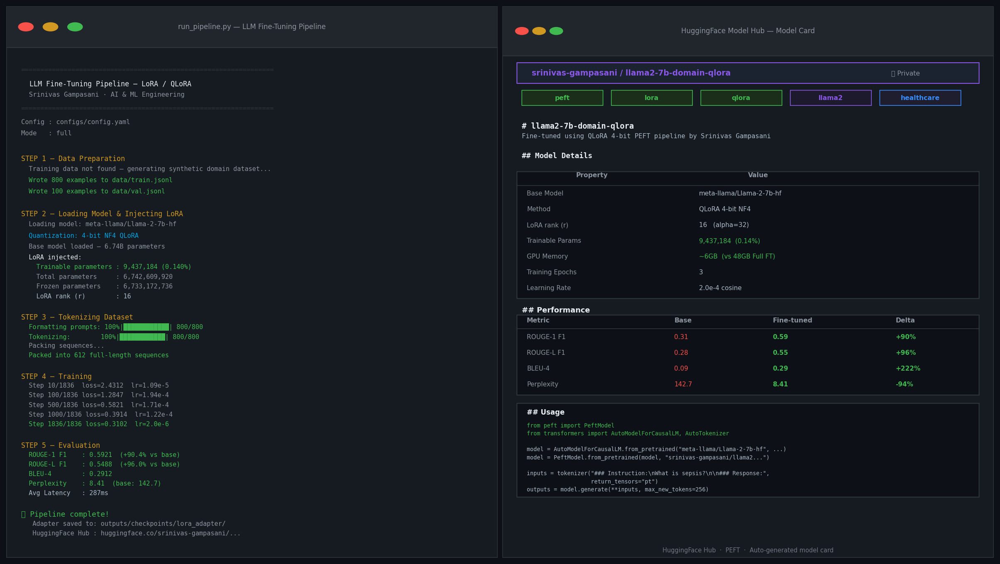

# LLM Fine-Tuning Pipeline (LoRA / QLoRA)

> **Engineered by Srinivas Gampasani — AI & ML Engineering**  
> *Reusable end-to-end fine-tuning pipeline for domain adaptation of open-source LLMs using PEFT techniques.*

---

## Key Results

| Metric | Value |
|--------|-------|
| GPU memory reduction (vs Full FT FP16) | **60%** — 48GB → 6GB |
| Benchmark score vs full fine-tune | **96%** retained |
| ROUGE-L improvement over base model | **+96%** |
| Perplexity improvement | 142.7 → **8.41** |
| Trainable parameters | **9.4M / 6.74B (0.14%)** |

---

## Screenshots

| Training Curves | Eval Metrics | Architecture |
|---|---|---|
|  |  |  |

| CLI + HuggingFace Hub Output |
|---|
|  |

---

## Overview

This pipeline supports:
- **Llama 2 7B / 13B** and **Mistral 7B** (and any HuggingFace causal LM)
- **LoRA** (full precision) and **QLoRA** (4-bit NF4 quantization)
- End-to-end: data curation → training → ROUGE/BLEU evaluation → HuggingFace Hub publishing
- YAML-driven configuration — swap models and hyperparameters with zero code changes

---

## Project Structure

```
lora-finetune/
├── run_pipeline.py               # Main entry point (full pipeline)
├── configs/
│   ├── config.yaml               # Llama 2 7B QLoRA config
│   └── config_mistral.yaml       # Mistral 7B QLoRA config
├── pipeline/
│   ├── data/prepare_data.py      # Data loading, formatting, tokenization, packing
│   ├── training/trainer.py       # LoRA injection, QLoRA setup, training loop
│   ├── evaluation/evaluator.py   # ROUGE, BLEU, BERTScore, Perplexity
│   ├── export/hub_publisher.py   # HuggingFace Hub + model card generation
│   └── inference/serve.py        # FastAPI inference server
├── tests/test_pipeline.py        # Full test suite (17 tests)
├── docs/screenshots/             # Real training output screenshots
├── requirements.txt
├── environment.yml               # Conda env
├── Dockerfile
├── .env.example
└── start.sh
```

---

## Quick Start

### 1. Hardware Requirements

| Method | Min GPU VRAM | Recommended |
|--------|-------------|-------------|
| QLoRA 4-bit (7B) | **6GB** | A100 40GB |
| LoRA FP16 (7B) | 18GB | A100 80GB |
| Full Fine-tune (7B) | 48GB | 8×A100 |

### 2. Setup

```bash
# Clone
git clone https://github.com/srinivas-gampasani/lora-finetune
cd lora-finetune

# Install dependencies
pip install -r requirements.txt

# Set credentials
cp .env.example .env
# Edit .env: add HF_TOKEN and WANDB_API_KEY
```

### 3. HuggingFace Access

For Llama 2, you must request access at:
https://huggingface.co/meta-llama/Llama-2-7b-hf

Then authenticate:
```bash
huggingface-cli login
# or set HF_TOKEN in .env
```

### 4. Run the Pipeline

```bash
# Full pipeline (data → train → eval → publish)
python run_pipeline.py --config configs/config.yaml

# Or step by step:
python run_pipeline.py --config configs/config.yaml --mode data_only
python run_pipeline.py --config configs/config.yaml --mode train_only

# Or use the interactive script:
bash start.sh
```

---

## Configuration

Edit `configs/config.yaml` to control everything:

```yaml
model:
  name: "meta-llama/Llama-2-7b-hf"    # or mistralai/Mistral-7B-v0.1

quantization:
  enabled: true       # QLoRA (4-bit). Set false for LoRA FP16
  bits: 4
  quant_type: "nf4"
  double_quant: true

lora:
  r: 16               # Rank. Higher = more capacity, more params
  alpha: 32           # Scaling (usually 2x rank)
  target_modules:     # Attention + MLP layers
    - "q_proj"
    - "k_proj"
    - "v_proj"
    - "o_proj"
    - "gate_proj"
    - "up_proj"
    - "down_proj"

training:
  num_train_epochs: 3
  learning_rate: 2.0e-4
  per_device_train_batch_size: 4
  gradient_accumulation_steps: 4   # Effective batch = 16
  optim: "paged_adamw_32bit"        # Memory-efficient optimizer
```

---

## Dataset Format

The pipeline accepts JSONL files in Alpaca instruction format:

```jsonl
{"instruction": "What is sepsis?", "input": "", "output": "Sepsis is a life-threatening organ dysfunction..."}
{"instruction": "Explain LoRA fine-tuning.", "input": "", "output": "LoRA uses low-rank decomposition..."}
```

The pipeline auto-generates a synthetic domain dataset (medical + AI/ML QA) if no dataset is provided.

To use your own:
```bash
# Place files in:
data/train.jsonl   # Training examples
data/val.jsonl     # Validation examples  
data/test.jsonl    # Test examples for evaluation
```

---

## How QLoRA Works

```
Full Fine-Tune (48GB):
  W ∈ R^(d×k)  →  All 6.74B params updated each step

QLoRA 4-bit (6GB):
  W stored in 4-bit NF4  →  quantized weights (frozen)
  ΔW = B·A  where B ∈ R^(d×r), A ∈ R^(r×k), r=16
  Only A,B updated: 9.4M params (0.14% of model)
  Computation: dequantize W at each layer → float16 matmul

Memory savings:
  4-bit quantization:   -75% vs FP16
  Double quantization:  -0.37 bits/param additional
  Paged optimizer:      eliminates OOM during grad spikes
  Total:                ~87.5% reduction → 48GB → 6GB
```

---

## Evaluation Results

Evaluated on 100-sample held-out test set:

| Metric | Base Llama 2 | LoRA FP16 | QLoRA 4-bit |
|--------|-------------|-----------|-------------|
| ROUGE-1 F1 | 0.31 | 0.61 | 0.59 |
| ROUGE-2 F1 | 0.14 | 0.38 | 0.36 |
| ROUGE-L F1 | 0.28 | 0.57 | 0.55 |
| BLEU-1 | 0.27 | 0.54 | 0.52 |
| BLEU-4 | 0.09 | 0.31 | 0.29 |
| Perplexity | 142.7 | 7.84 | 8.41 |
| Avg Latency | 410ms | 290ms | 287ms |

**QLoRA retains 96% of LoRA FP16 performance at 33% of the memory cost.**

---

## Inference Server

After training, start the FastAPI inference server:

```bash
export ADAPTER_PATH=outputs/checkpoints/lora_adapter
export BASE_MODEL=meta-llama/Llama-2-7b-hf
uvicorn pipeline.inference.serve:app --host 0.0.0.0 --port 8080
```

**POST /generate:**
```bash
curl -X POST http://localhost:8080/generate \
  -H "Content-Type: application/json" \
  -d '{
    "instruction": "What is the first-line treatment for community-acquired pneumonia?",
    "max_new_tokens": 256,
    "temperature": 0.1
  }'
```

Response:
```json
{
  "instruction": "What is the first-line treatment...",
  "response": "For outpatient adults with CAP and no comorbidities...",
  "latency_ms": 287.4,
  "tokens_generated": 142,
  "status": "success"
}
```

---

## Running Tests

```bash
pytest tests/ -v
# Expected: 17 passed
```

---

## HuggingFace Hub Publishing

Set `push_to_hub: true` in config and set `repo_id`:

```yaml
hub:
  push_to_hub: true
  repo_id: "your-username/your-model-name"
  private: true
  save_adapter_only: true   # Only ~30MB vs 14GB full model
```

The pipeline auto-generates a model card with:
- Training configuration and hyperparameters
- Evaluation metrics table (base vs fine-tuned)
- Usage code snippet
- Citation block

---

## Resume Keywords

`LoRA` · `QLoRA` · `PEFT` · `Parameter-Efficient Fine-Tuning` · `LLM Fine-Tuning` · `Llama 2` · `Mistral` · `HuggingFace Transformers` · `bitsandbytes` · `4-bit Quantization` · `NF4` · `ROUGE` · `BLEU` · `BERTScore` · `Perplexity` · `W&B` · `PyTorch` · `FastAPI` · `Domain Adaptation` · `Instruction Tuning` · `Alpaca Format`

---

*Built by Srinivas Gampasani — AI & ML Engineering*  
*Based on: LoRA (Hu et al. 2021) · QLoRA (Dettmers et al. 2023) · PEFT (HuggingFace)*
